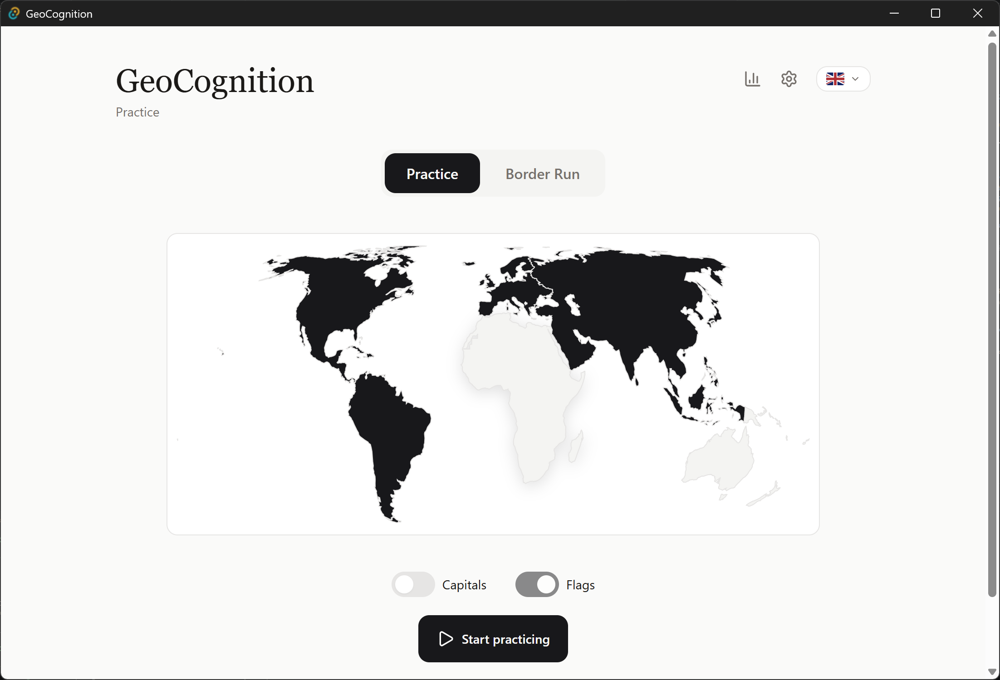
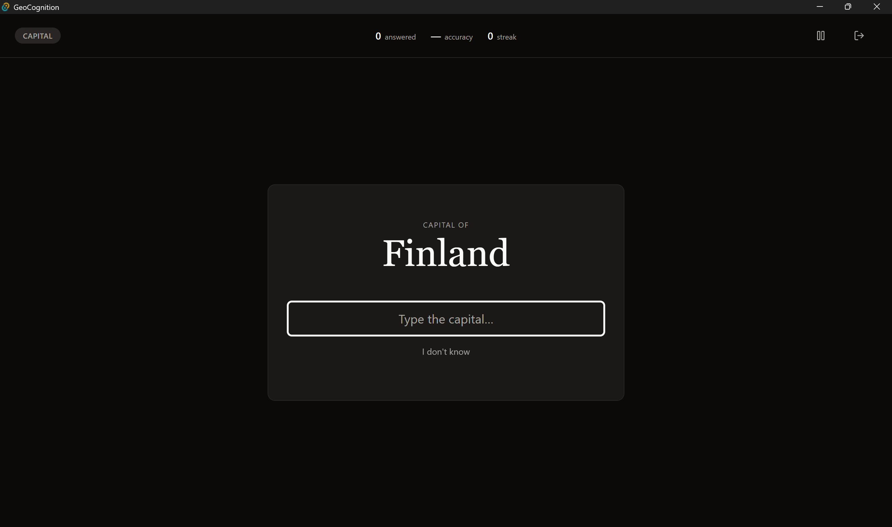
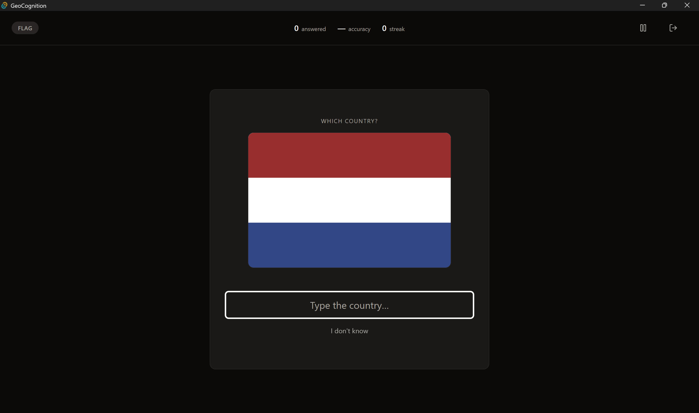
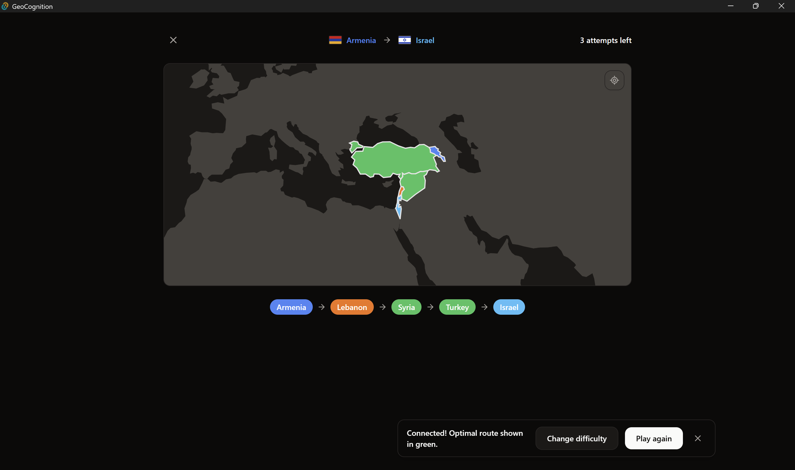
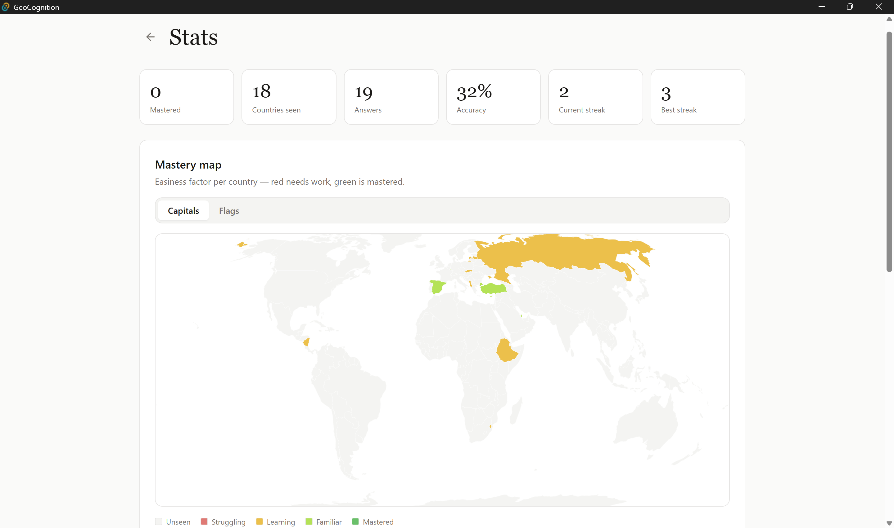
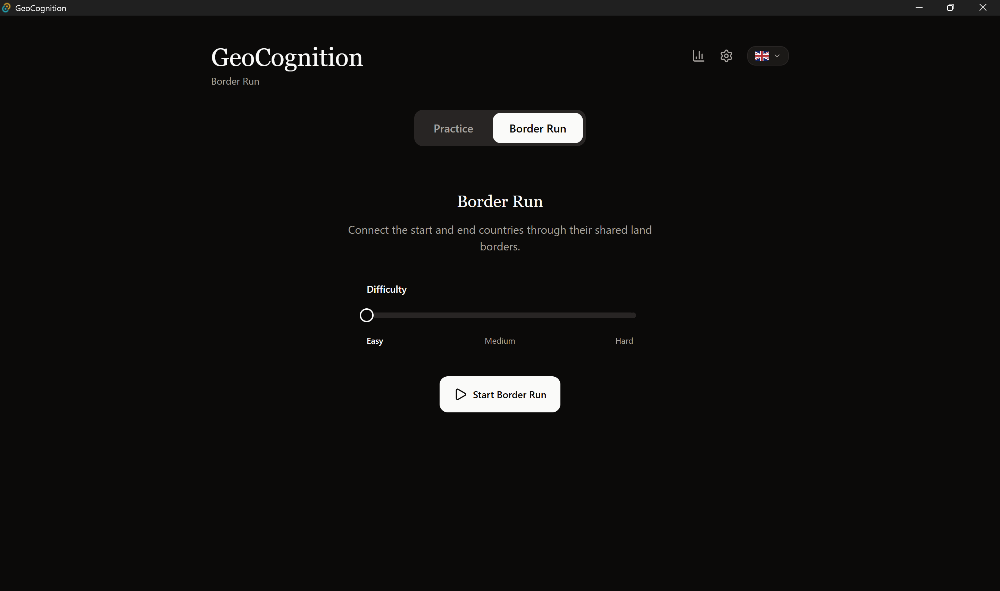
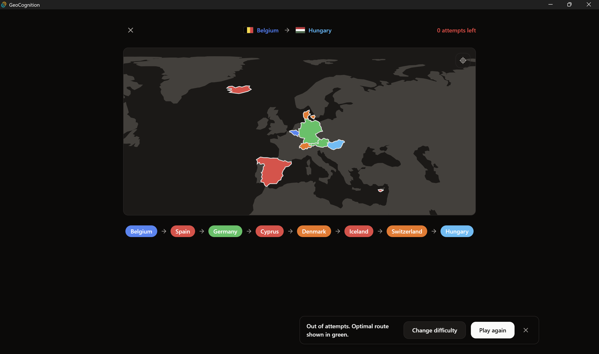

<div align="center">

<h1>GeoCognition</h1>

<p><strong>Master world geography through science-backed spaced repetition and strategic path-finding.</strong></p>

<p>
  
  
  
  
  
  
</p>



</div>

---

## What is GeoCognition?

GeoCognition is a cross-platform desktop app with two complementary modes for learning world geography:

- **Practice** — an infinite adaptive quiz (capitals + flags) driven by the **SuperMemo-2 spaced repetition algorithm**. The app learns which countries you struggle with and surfaces them more often, optimizing long-term retention.
- **Border Run** — a path-finding game where you must connect two countries by naming the chain of bordering nations between them. Think strategically, use your hint wisely, and don't run out of moves.

Fully offline. No account. No ads. Available in **English and French**.

---

## Screenshots

<table>
  <tr>
    <td align="center">
      
      <br /><sub>Capital quiz — Practice mode</sub>
    </td>
    <td align="center">
      
      <br /><sub>Flag identification — Practice mode</sub>
    </td>
  </tr>
  <tr>
    <td align="center">
      
      <br /><sub>Border Run — countries colored by path optimality</sub>
    </td>
    <td align="center">
      
      <br /><sub>Stats — world mastery heatmap</sub>
    </td>
  </tr>
  <tr>
    <td align="center">
      
      <br /><sub>Border Run setup — dark mode</sub>
    </td>
    <td align="center">
      
      <br /><sub>Border Run — result bar with optimal path revealed</sub>
    </td>
  </tr>
</table>

---

## Why this stack?

| Layer | Technology | Rationale |
|---|---|---|
| Desktop shell | **Tauri 2** | Native binary < 10 MB, strict sandboxing model, no bundled Chromium |
| Backend logic | **Rust** | Memory-safe systems language; SM-2 and graph algorithms as pure, fully-tested functions |
| Frontend | **React 18 + TypeScript** (strict) | Component-driven UI with zero `any` tolerance |
| Persistence | **SQLite** (via sqlx) | Local-first, no network dependency, structured queries |
| Styling | **Tailwind CSS + Framer Motion** | Design-token–based theming, smooth animations |
| Maps | **react-simple-maps + d3-geo** | Declarative SVG geography with projection math |

---

## Core algorithms

### SuperMemo-2 (SM-2) — Practice mode

Every country has an independent card per mode (`capital`, `flag`), each carrying three variables updated after every answer:

```
EF'  = max(1.3,  EF + 0.1 − (5 − q) × (0.08 + (5 − q) × 0.02))

I' = 1           if N = 1
   = 6           if N = 2
   = ⌈I × EF'⌉  if N > 2

next_review = now + I' days
```

Where `q ∈ {0, 3, 5}` is the answer quality (wrong / close / exact), `EF` is the easiness factor (floor 1.3), `I` is the current interval in days, and `N` is the repetition count. A wrong answer resets `N` to 0 and re-schedules the card for the next day. Cards answered incorrectly in the current session reappear after 7–9 questions (randomized per failure to avoid predictability).

The SM-2 implementation lives in `src-tauri/src/domain/sm2.rs` as a **pure function with no side effects** — the queue, the DB, and the UI are all decoupled from the algorithm.

### BFS pathfinding — Border Run mode

At game start, a BFS is run over the country adjacency graph (195 nodes, edges = shared land borders from REST Countries data) to compute:

1. The **shortest path length** between start and end → determines the attempt budget (`shortest_path_length + 3`)
2. The **set of all countries on any shortest path** → used to color placed countries green (on-path) vs orange (valid detour) vs red (disconnected)
3. Win detection: after each guess, a second BFS over `placed_countries ∪ {start, end}` checks if start and end are connected

Pairs are pre-bucketed by path length at startup (Easy: 2–3, Medium: 4–6, Hard: 7+) for O(1) random pair selection during gameplay.

---

## Features

### Practice mode
- **Infinite adaptive loop** — no fixed session length; the SM-2 queue always surfaces the most overdue or least mastered country
- **Two question types**: capitals (country name → type the capital) and flags (flag image → type the country name)
- **Bilingual answers** — correct answers accepted in English or French regardless of UI language
- **Fuzzy matching** — Levenshtein-based tolerance for typos (≤ 15% normalized distance = partial credit)
- **Drill rule** — missed countries reappear in 7–9 questions; mastered cards disappear for days
- **Continent selection** — interactive world map on the home screen; click a continent to include/exclude it
- **Mode toggles** — Capitals only, Flags only, or both mixed (weighted toward the less-practiced mode)

### Border Run mode
- **Path-finding challenge**: connect start → end by naming bordering countries
- **No adjacency restriction** — place any country; the game tracks whether your chain is actually connected
- **Color coding**: blue (start/end) · green (on shortest path) · orange (adjacent to shortest path) · red (disconnected)
- **Auto-zoom** at game start on the region containing start and end countries
- **Free pan + zoom** via trackpad / mouse wheel + drag; reset button to return to auto-zoom
- **Hint system** — one hint per game, reveals the first letter of an unplaced shortest-path country
- **Undo** — one undo per game, removes the last placed country and refunds one attempt
- **Result bar** — compact bottom bar on win/lose; auto-reveals the optimal path for non-optimal wins and losses

### General
- **Light / Dark / System** theme
- **English / French** UI with fully localized strings
- **Stats page**: world mastery heatmap, progression chart, forgetting curve overlay, continent radar, global counters
- **Fully offline** — all flag SVGs and map geometry are bundled; no network calls at runtime
- **Persistent settings** — theme, language, continent selection, difficulty, and active mode all survive restarts

---

## Architecture

```
geocognition/
├── src-tauri/                  Rust backend
│   ├── src/
│   │   ├── domain/             Pure business logic (no I/O)
│   │   │   ├── sm2.rs          SuperMemo-2 algorithm
│   │   │   ├── grading.rs      Bilingual fuzzy answer grading
│   │   │   ├── queue.rs        SM-2 priority queue + drill rule
│   │   │   └── border_run/     Path-finding game engine
│   │   │       ├── graph.rs    Adjacency graph
│   │   │       ├── pathfinding.rs  BFS + all-shortest-paths
│   │   │       ├── generator.rs    Random pair selection by difficulty
│   │   │       └── game.rs     Game state machine
│   │   ├── commands/           Tauri IPC commands (thin wrappers)
│   │   └── infra/              SQLite repository + migrations
│   ├── data/
│   │   └── countries.json      195 countries: names (EN+FR), capitals (EN+FR), borders, coordinates
│   └── tests/                  Integration tests
└── src/                        React + TypeScript frontend
    ├── components/
    │   ├── ui/                 Design system primitives
    │   ├── map/                World map components (selection + heatmap)
    │   ├── practice/           Quiz loop components
    │   ├── border-run/         Border Run game components
    │   └── stats/              Charts and analytics
    ├── pages/                  Route-level page components
    ├── store/                  Zustand state stores
    ├── domain/                 Pure TS helpers (localization, formatting)
    └── i18n/                   en.json / fr.json translation files
```

The architecture enforces a strict separation between **pure domain logic** (testable without any I/O), **infrastructure** (DB, file system), and **presentation** (React components). Tauri commands are thin shims — all business logic lives in `domain/` and is unit-tested independently.

---

## Getting started

### Prerequisites

| Tool | Version |
|---|---|
| Rust + Cargo | 1.78+ |
| Node.js | 20+ |
| pnpm | 9+ |
| Tauri CLI | 2.x (`cargo install tauri-cli --version "^2.0"`) |

On Linux, install the Tauri system dependencies:
```bash
sudo apt install libwebkit2gtk-4.1-dev libgtk-3-dev libayatana-appindicator3-dev librsvg2-dev
```

### Run in development
```bash
git clone https://github.com/DavidDayan21/GeoCognition.git
cd GeoCognition
pnpm install
pnpm tauri dev
```

The SQLite database is created automatically in your OS app-data directory on first launch and seeded with all 195 countries.

### Build for production
```bash
pnpm tauri build
```

Outputs a native installer for your platform (`.msi` on Windows, `.dmg` on macOS, `.AppImage`/`.deb` on Linux).

### Run tests
```bash
cargo test          # Rust domain + integration tests
pnpm test:unit      # TypeScript unit tests (Vitest)
pnpm test:e2e       # End-to-end tests (Playwright)
```

---

## Download

Pre-built installers for Windows, macOS, and Linux are available on the [Releases page](https://github.com/DavidDayan21/GeoCognition/releases).

---

## Roadmap

- [ ] "Locate it" mode — click on the map where a country is located (spatial memory)
- [ ] Daily Border Run challenge (fixed pair per day, shareable score)
- [ ] Export progress report as PDF
- [ ] Mnemonic hints powered by AI (for persistently difficult countries)
- [ ] SQLCipher encryption for local data at rest

---

## License

MIT © [David Dayan](https://github.com/DavidDayan21)
